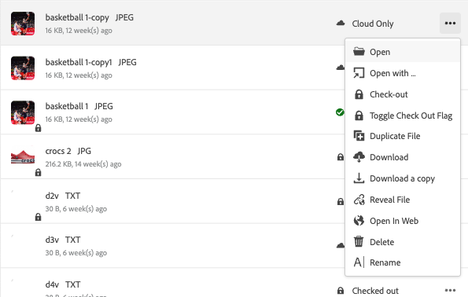
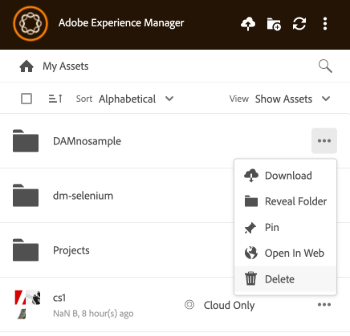

# Tarefas de gerenciamento do Assets em [!DNL AEM Desktop App] {#assets-management-tasks}

O gerenciamento de ativos envolve a organização, manutenção e otimização de ativos digitais para simplificar fluxos de trabalho. Inclui tarefas como duplicar e renomear arquivos, fixar ou desfixar pastas para acesso rápido e visualizar ativos em vários layouts. Isso ajuda a melhorar a eficiência, simplificar o rastreamento de ativos e garantir uma fácil recuperação e organização de ativos digitais em todas as plataformas.

## Exibir ativos {#view-assets}

O aplicativo de desktop do AEM permite exibir ativos em quatro visualizações diferentes:

* **[!UICONTROL Show Assets]:** Permite que você exiba todos os ativos.
* **[!UICONTROL Show Collections]:** Permite que você veja todas as coleções criadas no aplicativo AEM nativo. Ver mais [coleções](#collections-desktop-app).
* **[!UICONTROL Edited Locally]:** Permite mostrar todos os ativos modificados localmente. Nesta visualização, é possível adicionar e fazer upload de vários ativos.
* **[!UICONTROL Asset transfers]:** Permite que você visualize todos os ativos transferidos do aplicativo nativo para o local ou vice-versa.
* **[!UICONTROL Pinned items]:** Permite que você exiba todos os itens fixados.

Para escolher entre várias exibições de ativos no aplicativo AEM Desktop, execute as seguintes etapas:

1. Abra o aplicativo de desktop do AEM.

1. Acesse o menu suspenso Exibir no canto superior direito. Escolha uma entre as exibições disponíveis.

   

## Exibir pastas e arquivos recém-adicionados {#view-newly-added-files-folders}

Você pode fazer upload de ativos recém-criados da máquina local para o AEM, onde o repositório central está armazenado. Para exibir localmente esses ativos recém-criados, vá para o menu suspenso **[!UICONTROL View]** e selecione **[!UICONTROL Show Assets]** para exibir todas as atualizações com sua linha do tempo e títulos, ou selecione **[!UICONTROL Edited Locally]**. Ambas as opções mostram explicitamente os ativos editados localmente.

## Arquivos duplicados {#duplicate-files}

Quando quiser preservar um arquivo original e fazer alterações no arquivo semelhante, você poderá duplicar arquivos em diferentes locais (local e nuvem) simultaneamente. Isso pode ser feito por meio da operação de arquivos duplicados nos ativos.

Para duplicar arquivos no aplicativo de desktop do AEM, siga as etapas abaixo:

1. Navegue até uma pasta e selecione o ativo que deseja duplicar.

   

1. Clique no ícone **[!UICONTROL More actions]**  e selecione a ação  **[!UICONTROL Duplicate File]**.

1. O arquivo duplicado é criado com um nome de arquivo e conteúdo idênticos.

## Renomear título de um ativo ou pasta {#rename-asset-title}

Para renomear o título de um ativo ou pasta, execute as etapas abaixo:

1. Navegue pelo ativo que deseja renomear. Ao nomear uma pasta, caracteres especiais como `\ / : * ?  | < > [ ] %`; não são permitidos. Se forem incluídas, elas serão substituídas automaticamente por um hífen `-`.

1. Clique no ícone **[!UICONTROL More actions]**  e selecione **[!UICONTROL Rename]** para adicionar o título desejado de um ativo.

## Fixar ou Desfixar pasta {#pin-unpin-folder}

As pastas fixadas são sincronizadas automaticamente para refletir quaisquer alterações feitas nativamente no aplicativo. Para obter acesso rápido, você pode fixar ou desfixar uma pasta executando as etapas abaixo:

1. Navegue pelo ativo que deseja fixar ou desfixar.

1. Clique em **[!UICONTROL More actions]**  e selecione [!UICONTROL pin] para fixar o ativo ou a pasta. Como alternativa, clique em [!UICONTROL unpin] para desafixá-lo.

   

## Atualização automática {#auto-refresh}

O recurso de atualização automática atualiza automaticamente o conteúdo em tempo real, garantindo que você sempre veja as informações mais recentes sem recarregar manualmente a página. Execute as etapas abaixo para atualizar ativos automaticamente e obter a lista de ativos atualizados:

1. Abra o aplicativo de desktop do AEM.

1. Clique em  na barra de menus para obter as atualizações.

## Coleções {#collections-desktop-app}

O Aplicativo de Desktop do AEM permite [exibir](#view-collections-desktop-app), [baixar](#download-collections-desktop-app) e procurar coleções criadas no aplicativo [!DNL Adobe Experience Manager Assets].

### Exibir coleções {#view-collections-desktop-app}

Execute as seguintes etapas para exibir coleções no Aplicativo de desktop:

1. Abra o aplicativo de desktop do AEM e vá para [exibir ativos](#view-assets).

1. Selecione **[!UICONTROL Show Collections]**. As coleções disponíveis no aplicativo nativo são mostradas.

   

### Baixar coleções {#download-collections-desktop-app}

Execute as seguintes etapas para baixar coleções no Aplicativo de desktop:

1. Siga as etapas 1 e 2 conforme mostrado em [exibir Coleções](#view-collections-desktop-app).

1. Vá para mais ações  na coleção que você deseja baixar.

1. Clique em **[!UICONTROL Download]** para baixar a coleção específica.

## Criar pasta com esquema de metadados {#create-folder-with-metadata-schema}

Usando o aplicativo de desktop do AEM, você pode atribuir metadados ao criar uma nova pasta. Para fazer isso, execute as seguintes etapas:

1. Vá para o ícone de criar diretório . A tela **[!UICONTROL Create Directory]** é exibida.

1. Adicione os seguintes detalhes:
   * **[!UICONTROL Name]** da pasta.
   * **[!UICONTROL Folder Metadata Schema]** para escolher a hierarquia de metadados da pasta ou escolha **[!UICONTROL none]** se não quiser relacionar nenhum metadado a ela.

1. Clique em **[!UICONTROL OK]** para continuar.

## Lista de ativos transferidos {#list-of-transferred-assets}

Para exibir a lista de ativos transferidos em uma determinada sessão, consulte [Carregar ativos para [!DNL Experience Manager]](#upload-and-add-new-assets-to-aem).

## Fluxo de trabalho avançado: colabore nos mesmos arquivos e evite conflitos de edição {#adv-workflow-collaborate-avoid-conflicts}

Em ambientes colaborativos, vários usuários podem trabalhar no mesmo conjunto de ativos que podem levar a conflitos de versão. Para evitar conflitos, siga estas práticas recomendadas:

* Não edite nenhum ativo clicando em [!UICONTROL Open]. Não edite os ativos baixados localmente abrindo na pasta do sistema de arquivos. Outros usuários não sabem que o ativo está sendo editado.
* Para editar um ativo, sempre clique em [!UICONTROL Edit]. Ele abre o ativo no aplicativo nativo e adiciona um ícone de bloqueio no ativo para que os outros usuários saibam que o ativo está sendo editado.
* Clique em [!UICONTROL Toggle Check-in] se você acidentalmente começar a editar sem clicar em [!UICONTROL Edit]. Essa funcionalidade adiciona um ícone de bloqueio ao ativo. Mesmo que você planeje editar um ativo mais tarde, mas evite que outras pessoas o editem, clique em [!UICONTROL Toggle Check-in] para bloquear o ativo.
* Antes de editar um ativo, verifique se outros usuários não o estão editando. Procure o ícone de bloqueio no ativo.
* Após concluir as edições, faça upload de todas as alterações e faça check-in do ativo.

Se um ativo baixado localmente for atualizado no servidor [!DNL Experience Manager], o aplicativo exibirá um status **[!UICONTROL Modified remotely]**. Você pode remover sua cópia local ou atualizar sua cópia local, clicando em [!UICONTROL Remove] ou [!UICONTROL Update] respectivamente. Os links na caixa de diálogo permitem exibir ambas as versões do ativo.

Se um ativo que você está editando localmente também for atualizado no servidor sem o seu conhecimento, o aplicativo exibirá um status de **[!UICONTROL Editing Conflict]**. Você pode reter um conjunto de alterações - retenha suas atualizações (clique em **[!UICONTROL Keep Mine]**) e exclua a edição do outro usuário ou respeite as atualizações do outro usuário e exclua as suas (**[!UICONTROL Overwrite Mine]**).

## Fluxo de trabalho avançado: colocar e vincular ativos no arquivo do InDesign {#adv-workflow-place-assets-indesign}

Quando você usa o aplicativo de desktop [!DNL Experience Manager] para abrir arquivos com ativos vinculados, os ativos são pré-baixados e aparecem colocados nos aplicativos nativos. Para que esse fluxo de trabalho funcione, seu aplicativo nativo deve oferecer suporte à colocação de links para ativos locais e o [!DNL Experience Manager] deve oferecer suporte à resolução desses links nos arquivos binários para referências do lado do servidor.

O aplicativo de desktop do [!DNL Experience Manager] é compatível com esse fluxo de trabalho com alguns aplicativos de desktop e formatos de arquivo selecionados da Adobe Creative Cloud - Adobe InDesign, Adobe Illustrator e Adobe Photoshop. O fluxo de trabalho permite trabalhar com eficiência com os arquivos Creative Cloud compatíveis. Se o usuário A adicionar ativos a um arquivo do InDesign e fizer o check-in dele em [!DNL Experience Manager], o usuário B poderá ver os ativos no arquivo mesmo que eles não façam parte dele. Os ativos são baixados localmente no computador do usuário B.

>[!NOTE]
>
>O aplicativo de desktop pode ser mapeado para qualquer unidade no Windows. No entanto, para operações suaves, não altere a letra da unidade padrão. Se os usuários da mesma organização usarem letras de unidade diferentes, eles não poderão ver os ativos colocados por outros. Os ativos colocados não são buscados conforme o caminho muda. Os ativos colocados continuam a ser colocados no arquivo binário (digamos, INDD) e não são removidos.

Para saber as limitações desse fluxo de trabalho, consulte os [requisitos do sistema e as versões com suporte](release-notes.md).

Para experimentar esse fluxo de trabalho com um ativo de imagem e o InDesign, siga estas etapas:

1. Mantenha-se à mão com um arquivo INDD com ativos colocados em [!DNL Experience Manager]. Para saber como criar esse arquivo INDD, consulte [Inserção de Gráficos](https://helpx.adobe.com/br/indesign/using/placing-graphics.html).
1. No aplicativo de desktop, **[!UICONTROL Edit]** o arquivo INDD com os ativos colocados em [!DNL Experience Manager].
1. O aplicativo baixa o arquivo InDesign e os ativos vinculados. Quando o InDesign abre o documento, os links são resolvidos, os ativos são baixados e os ativos são exibidos no documento do InDesign.
1. Para inserir um novo gráfico no arquivo InDesign, use a ação **[!UICONTROL Reveal File]** no ativo. A ação baixa o ativo localmente e abre o local de compartilhamento de rede local no Windows Explorer ou no Mac Finder.
1. Inserir o ativo revelado no documento do InDesign. Isso criará um link no documento.
1. Depois de concluir suas edições no documento do InDesign, salve-o e carregue-o para [!DNL Experience Manager] usando o aplicativo de desktop.

## Próximas etapas {#next-steps}

* [Assista a um vídeo para começar a usar o Adobe Experience Manager Desktop App](https://experienceleague.adobe.com/pt-br/docs/experience-manager-learn/assets/creative-workflows/aem-desktop-app)

* Forneça feedback sobre a documentação usando a [!UICONTROL Edit this page]  ou [!UICONTROL Log an issue]  disponível na barra lateral direita

* Entre em contato com o [Atendimento ao cliente](https://experienceleague.adobe.com/pt-br?support-solution=General#support)

<!--* Provide product feedback using the [!UICONTROL Feedback] option available on the AEM Desktop App user interface>-->

>[!MORELIKETHIS]
>
>* [Entender a interface](/help/using/user-interface.md).
>* [Guia de introdução](/help/using/get-started.md).
