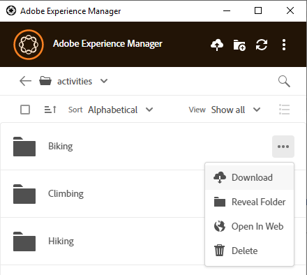
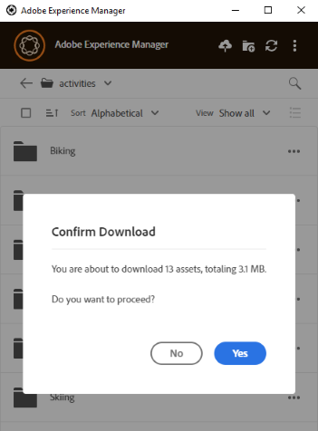

# Baixar ativos localmente {#download-assets-locally}

O aplicativo baixa ativos do servidor [!DNL Experience Manager] com frequência para o sistema de arquivos local. Os downloads consomem largura de banda e espaço em disco. Conhecer os cenários pode ajudar a otimizar o tempo de espera até que os downloads sejam concluídos. Você pode baixar os ativos no sistema de arquivos local. O aplicativo busca os ativos do servidor [!DNL Experience Manager] e salva a mesma cópia no sistema de arquivos local.

Clique no **[!UICONTROL More actions]**  para opções e clique no  para baixar.

>[!NOTE]
>
>Ao baixar ou carregar um arquivo grande ou muitos arquivos, o aplicativo desativa as ações nos ativos e pastas. As ações estão disponíveis quando o download ou upload for concluído.

Ao usar a ação [!UICONTROL Open] para abrir um ativo em um aplicativo de desktop nativo, o ativo é baixado localmente se ainda não estiver disponível localmente. Consulte [Abrir ativos](#openondesktop-v2).

Quando você revela o local de um ativo ou de uma pasta no aplicativo, primeiro o ativo ou a pasta é baixada localmente e depois aberta no computador no compartilhamento de rede local. Consulte [Abrir ativos](#openondesktop-v2).

Quando você usa a ação [!UICONTROL Edit] para editar um ativo em um aplicativo de desktop nativo, o ativo é baixado localmente se ainda não estiver disponível localmente. Consulte [Editar ativos e carregar ativos atualizados para [!DNL Experience Manager]](#edit-assets-upload-updated-assets).

Se o aplicativo estiver instalado e tiver permissão para, ele concluirá as ações quando você usar [!UICONTROL Desktop Actions] da interface da Web do [!DNL Experience Manager]. O aplicativo baixa o ativo primeiro e depois conclui a ação.

## Baixar vários ativos {#download-multiple-assets}

O download de vários ativos pode levar a um desempenho insatisfatório se o tamanho da fila for grande ou se você enfrentar algum problema de rede. Além disso, você pode colocar muitos ativos na fila para download sem saber ao baixar uma pasta. Para evitar longos tempos de espera, o aplicativo restringe o número de ativos baixados de uma só vez. Para saber como configurá-lo, consulte [Definir preferências](install-upgrade.md#set-preferences). Mesmo abaixo desse limite, o aplicativo pode às vezes buscar uma confirmação antes de baixar uma pasta aparentemente grande.

Se as pastas forem selecionadas e baixadas, o aplicativo baixará apenas os ativos armazenados diretamente nas pastas no [!DNL Experience Manager]. Ele não baixa ativos de subpastas automaticamente.

## Próximas etapas {#next-steps}

* [Assista a um vídeo de introdução ao aplicativo de desktop do Adobe Experience Manager](https://experienceleague.adobe.com/en/docs/experience-manager-learn/assets/creative-workflows/aem-desktop-app)

* Forneça feedback sobre a documentação usando a [!UICONTROL Edit this page]  ou [!UICONTROL Log an issue]  disponível na barra lateral direita

* Entre em contato com o [Atendimento ao cliente](https://experienceleague.adobe.com/pt-br?support-solution=General#support)

>[!MORELIKETHIS]
>
>* [Carregar ativos](/help/using/upload-assets.md)
>* [Entender a interface de usuário](/help/using/user-interface.md)
>* [Pesquisar](/help/using/search.md)
