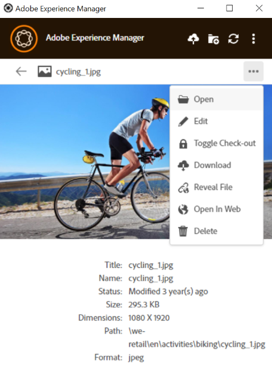

# Procurar, pesquisar e visualizar ativos {#browse-search-preview-assets}

Você pode navegar, procurar e visualizar os ativos disponíveis no repositório do [!DNL Experience Manager], tudo a partir do aplicativo de desktop. Tente o seguinte no aplicativo:

1. Navegue até uma pasta e veja algumas informações básicas sobre os ativos disponíveis na pasta, juntamente com pequenas miniaturas de todos os ativos.

   

1. Para exibir mais informações e uma miniatura maior de um ativo individual, clique no nome do arquivo.

   

1. Clique em **[!UICONTROL Open]** ou **[!UICONTROL Edit]** para baixar o arquivo localmente e apenas exibi-lo ou editá-lo no aplicativo nativo, respectivamente.
1. Pesquise usando palavras-chave para localizar um ativo relacionado no repositório [!DNL Experience Manager]. Use `?` e `*` como curingas. Esses curingas substituem um único caractere por vários caracteres, respectivamente. Filtre e classifique os resultados conforme necessário.

   

   

>[!NOTE]
>
>O aplicativo exibe os ativos correspondendo aos critérios de pesquisa em vários campos de metadados e não apenas o título do ativo ou o nome do arquivo.

## Abrir ativos no desktop {#openondesktop-v2}

É possível abrir os ativos remotos para visualização no aplicativo nativo. Os ativos são baixados para uma pasta local. Em seguida, são iniciados no aplicativo nativo associado ao formato de arquivo. Você pode alterar o aplicativo nativo para abrir tipos de arquivos específicos (extensões) no Mac ou no Windows.

Clique em **[!UICONTROL Open]** no menu de ativos. O ativo é baixado localmente e aberto no aplicativo nativo. Verifique o progresso do download e a velocidade de transferência de ativos grandes na barra de status.

<!-- 
-->

>[!NOTE]
>
>Se as alterações esperadas não forem refletidas no aplicativo, clique no ícone de atualização  ou clique com o botão direito na interface do aplicativo e clique em **[!UICONTROL Refresh]**. As ações não estão disponíveis enquanto downloads ou uploads maiores estão em andamento.

Para abrir a pasta de download local de um ativo, clique no ícone  e clique na ação  **[!UICONTROL Reveal File]**.

## Usar ou colocar ativos em documentos nativos {#place-assets-in-native-documents}

Em alguns casos, ao colocar um ativo em um documento nativo, você acessa um arquivo no Windows Explorer ou no Mac Finder. Para acessar o local do sistema de arquivos do arquivo baixado localmente, use a opção  **[!UICONTROL Reveal File]**.

Clique em **[!UICONTROL Reveal File]** ou **[!UICONTROL Reveal Folder]** em uma pasta para abrir o Windows Explorer ou o Mac Finder com o arquivo ou pasta pré-selecionado no computador local. Como exemplo, a opção é útil para colocar os arquivos [!DNL Experience Manager] nos aplicativos nativos que oferecem suporte à colocação ou vinculação de arquivos locais. Para ver como colocar arquivos no Adobe InDesign, consulte [Inserção de gráficos](https://helpx.adobe.com/br/indesign/using/placing-graphics.html).

A ação **[!UICONTROL Reveal File]** abre um compartilhamento de rede local. Ele exibe somente os ativos que estão disponíveis localmente. Ou seja, exibe ativos que foram revelados, baixados ou abertos/editados usando o aplicativo. O compartilhamento de rede local não carrega nenhuma alteração em [!DNL Experience Manager]. Para carregar as alterações, use explicitamente as ações **[!UICONTROL Upload Changes]** ou **[!UICONTROL Upload]** no aplicativo.

>[!NOTE]
>
>Para compatibilidade com versões anteriores com o aplicativo de desktop [!DNL Experience Manager] v1.x, os arquivos revelados são enviados de um compartilhamento de rede local, expondo somente arquivos disponíveis localmente. Os caminhos da área de trabalho dos arquivos revelados são os mesmos caminhos criados pelo aplicativo v1.x.

>[!CAUTION]
>
>Não use a opção **[!UICONTROL Reveal File]** para editar ativos em aplicativos nativos. Em vez disso, use as ações **[!UICONTROL Edit]**. Para saber mais, consulte [Fluxo de trabalho avançado: colaborar nos mesmos arquivos e evitar conflitos de edição](#adv-workflow-collaborate-avoid-conflicts).

### Gerenciar caracteres especiais nos nomes de ativos {#special-characters-in-filename}

No aplicativo herdado, os nomes de nó criados no repositório mantiveram os espaços e os caracteres maiúsculos e minúsculos dos nomes de pasta fornecidos pelo usuário. Para que o aplicativo atual emule as regras de nomenclatura de nó do aplicativo v1.10, habilite [!UICONTROL Use legacy conventions when creating nodes for assets and folders] em [!UICONTROL Preferences]. Consulte [preferências do aplicativo](/help/using/install-upgrade.md#set-preferences). Esta preferência de legado está desativada por padrão.

>[!NOTE]
>
>O aplicativo altera apenas os nomes dos nós no repositório usando as seguintes convenções de nomenclatura. O aplicativo retém o `Title` do ativo como está.

| Caracteres ‡ | Preferência Herdada no aplicativo | Quando ocorrer em nomes de arquivo | Quando ocorrer em nomes de pasta | Exemplo |
|---|---|---|---|---|
| `. / : [ ] \| *` | Ativado ou desativado | Substituído por `-` (hífen). Um `.` (ponto) na extensão do nome de arquivo é retido como está. | Substituído por `-` (hífen). | `myimage.jpg` permanece como está e `my.image.jpg` muda para `my-image.jpg`. |
| `% ; # , + ? ^ { } "` e espaços em branco |  desabilitado | Os espaços em branco são retidos | Substituído por `-` (hífen). | `My Folder.` alterações feitas em `my-folder-`. |
| `# % { } ? & .` |  desabilitado | Substituído por `-` (hífen). | N. D. | `#My New File.` alterações feitas em `-My New File-`. |
| Caracteres em maiúsculas |  desabilitado | A caixa é retida como está. | Alterado para caracteres em minúsculas. | `My New Folder` alterações feitas em `my-new-folder`. |
| Caracteres em maiúsculas |  Habilitado | A caixa é retida como está. | A caixa é retida como está. | N. D. |

‡ A lista de caracteres é uma lista separada por espaços em branco.

## Localizar todas as imagens editadas {#find-all-edited-images}

O aplicativo fornece um modo de exibição, chamado **[!UICONTROL Edited locally]**, para que você tenha acesso rápido a todos os arquivos baixados localmente (por meio de ações [!UICONTROL Open] ou [!UICONTROL Edit]) e depois modificados. O aplicativo permite selecionar todos os ativos editados localmente e fazer upload das alterações com apenas alguns cliques. Essa exibição também mostra os ativos editados localmente que têm um conflito de edição.

## Próximas etapas {#next-steps}

* [Assista a um vídeo para começar a usar o Adobe Experience Manager Desktop App](https://experienceleague.adobe.com/pt-br/docs/experience-manager-learn/assets/creative-workflows/aem-desktop-app)

* Forneça feedback sobre a documentação usando a [!UICONTROL Edit this page]  ou [!UICONTROL Log an issue]  disponível na barra lateral direita

* Entre em contato com o [Atendimento ao cliente](https://experienceleague.adobe.com/pt-br?support-solution=General#support)

>[!MORELIKETHIS]
>
>* [Entender a interface de usuário](/help/using/user-interface.md)
>* [Usando o Aplicativo de Área de Trabalho](/help/using/using-desktop-app.md)
>* [Gerenciando o Assets no Aplicativo de Desktop](/help/using/assets-management-tasks.md)
