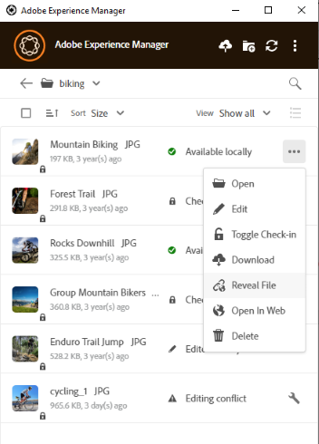

# Abrir ativos no desktop {#openondesktop-v2}

É possível abrir os ativos remotos para visualização no aplicativo nativo. Os ativos são baixados para uma pasta local. Em seguida, são iniciados no aplicativo nativo associado ao formato de arquivo. Você pode alterar o aplicativo nativo para abrir tipos de arquivos específicos (extensões) no Mac ou no Windows.

Clique em **[!UICONTROL Open]** no menu de ativos. O ativo é baixado localmente e aberto no aplicativo nativo. Verifique o progresso do download e a velocidade de transferência de ativos grandes na barra de status.

<!-- 
-->

>[!NOTE]
>
>Se as alterações esperadas não forem refletidas no aplicativo, clique no ícone de atualização  ou clique com o botão direito na interface do aplicativo e clique em **[!UICONTROL Refresh]**. As ações não estão disponíveis enquanto downloads ou uploads maiores estão em andamento.

Para abrir a pasta de download local de um ativo, clique no ícone  e clique na ação  **[!UICONTROL Reveal File]**.

## Usar ou colocar ativos em documentos nativos {#place-assets-in-native-documents}

Em alguns casos, ao colocar um ativo em um documento nativo, você acessa um arquivo no Windows Explorer ou no Mac Finder. Para acessar o local do sistema de arquivos do arquivo baixado localmente, use a opção  **[!UICONTROL Reveal File]**.

Clique em **[!UICONTROL Reveal File]** ou **[!UICONTROL Reveal Folder]** em uma pasta para abrir o Windows Explorer ou o Mac Finder com o arquivo ou pasta pré-selecionado no computador local. Como exemplo, a opção é útil para colocar os arquivos [!DNL Experience Manager] nos aplicativos nativos que oferecem suporte à colocação ou vinculação de arquivos locais. Para ver como colocar arquivos no Adobe InDesign, consulte [Inserção de gráficos](https://helpx.adobe.com/br/indesign/using/placing-graphics.html).

A ação **[!UICONTROL Reveal File]** abre um compartilhamento de rede local. Ele exibe somente os ativos que estão disponíveis localmente. Ou seja, exibe ativos que foram revelados, baixados ou abertos/editados usando o aplicativo. O compartilhamento de rede local não carrega nenhuma alteração em [!DNL Experience Manager]. Para carregar as alterações, use explicitamente as ações **[!UICONTROL Upload Changes]** ou **[!UICONTROL Upload]** no aplicativo.

>[!NOTE]
>
>Para compatibilidade com versões anteriores com o aplicativo de desktop [!DNL Experience Manager] v1.x, os arquivos revelados são enviados de um compartilhamento de rede local, expondo somente arquivos disponíveis localmente. Os caminhos da área de trabalho dos arquivos revelados são os mesmos caminhos criados pelo aplicativo v1.x.

>[!CAUTION]
>
>Não use a opção **[!UICONTROL Reveal File]** para editar ativos em aplicativos nativos. Em vez disso, use as ações **[!UICONTROL Edit]**. Para saber mais, consulte [Fluxo de trabalho avançado: colaborar nos mesmos arquivos e evitar conflitos de edição](#adv-workflow-collaborate-avoid-conflicts).

## Próximas etapas {#next-steps}

* [Assista a um vídeo para começar a usar o Adobe Experience Manager Desktop App](https://experienceleague.adobe.com/pt-br/docs/experience-manager-learn/assets/creative-workflows/aem-desktop-app)

* Forneça feedback sobre a documentação usando a [!UICONTROL Edit this page]  ou [!UICONTROL Log an issue]  disponível na barra lateral direita

* Entre em contato com o [Atendimento ao cliente](https://experienceleague.adobe.com/pt-br?support-solution=General#support)

>[!MORELIKETHIS]
>
>* [Entender a interface de usuário](/help/using/user-interface.md)
>* [Gerenciando o Assets no Aplicativo de Desktop](/help/using/assets-management-tasks.md)
>* [Pesquisar](/help/using/search.md)
