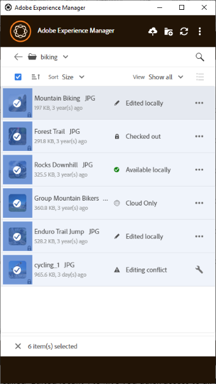

# Usar o aplicativo de desktop [!DNL Adobe Experience Manager]  {#use-aem-desktop-app-v2}

Use o aplicativo de desktop do [!DNL Adobe Experience Manager] para acessar ativos digitais armazenados em um repositório DAM do [!DNL Adobe Experience Manager] na área de trabalho local. Em seguida, você pode usar esses ativos em qualquer aplicativo de desktop. Você pode abrir e editar os ativos localmente em aplicativos de desktop. Depois de fazer alterações, carregue-as de volta para [!DNL Experience Manager] com controle de versão para compartilhar atualizações com outros usuários. Você também pode carregar novos arquivos e hierarquias de pastas para o [!DNL Experience Manager], criar pastas e excluir ativos ou pastas do DAM [!DNL Experience Manager].

A integração permite que várias funções na organização gerenciem os ativos de forma central no [!DNL Experience Manager Assets] e acessem os ativos no desktop local nos aplicativos nativos no Windows ou macOS.

Quando você abrir o aplicativo depois de fazer logoff ou pela primeira vez, forneça a URL do servidor [!DNL Experience Manager] no formato `https://[aem-server-url]:[port]/`. Em seguida, selecione a opção [!UICONTROL Connect]. Forneça credenciais para conectar o aplicativo ao servidor.

As principais tarefas que você executa usando o aplicativo de desktop [!DNL Adobe Experience Manager] são:

![Fluxos de trabalho e tarefas que você pode realizar usando o aplicativo de desktop [!DNL Experience Manager]](assets/aem_desktop_app_usecases_v2.png "Fluxos de trabalho e tarefas que você pode realizar usando o  [!DNL Adobe Experience Manager] aplicativo de desktop")

Baixar [este](assets/aem_desktop_app_usecases_print.pdf) arquivo PDF pronto para impressão.

## Como o aplicativo de desktop funciona {#how-app-works2}

Antes de começar a usar o aplicativo, [entenda como o aplicativo funciona](release-notes.md#how-app-works). Além disso, familiarize-se com os seguintes termos:

* **[!UICONTROL Desktop Actions]**: na interface da Web do Assets, de dentro de um navegador, você pode explorar os locais dos ativos ou fazer check-out e abrir o ativo para edição no aplicativo de desktop nativo. Essas ações estão disponíveis na interface da Web e usam a funcionalidade do aplicativo de desktop. Consulte [como habilitar ações da área de trabalho](using.md#desktopactions-v2).

* O status do arquivo é **[!UICONTROL Cloud Only]**: esses ativos não são baixados no computador local e estão disponíveis somente no servidor [!DNL Experience Manager].

* O status do arquivo é **[!UICONTROL Available locally]**: os ativos são baixados e disponibilizados no computador local como estão. Os ativos não são alterados.

* O status do arquivo é **[!UICONTROL Edited locally]**: esses ativos são modificados localmente e as alterações permanecem no arquivo carregado para o servidor [!DNL Experience Manager]. Após o carregamento, o status muda para [!UICONTROL Available locally]. Consulte [editar ativos](using.md#edit-assets-upload-updated-assets).

* O status do arquivo é **[!UICONTROL Editing conflict]**: se você e outras pessoas editarem um ativo simultaneamente, o aplicativo indicará que um conflito de edição ocorreu. O aplicativo também fornece opções para reter ou descartar suas alterações. Consulte [como evitar conflitos de edição](using.md#adv-workflow-collaborate-avoid-conflicts).

* O status do arquivo é **[!UICONTROL Modified remotely]**: o aplicativo indica se um ativo que você baixou foi alterado no servidor [!DNL Experience Manager]. O aplicativo também oferece a opção de baixar a versão mais recente e atualizar a cópia local. Consulte [como evitar conflitos de edição](using.md#adv-workflow-collaborate-avoid-conflicts).

* **[!UICONTROL Check-out]**: Se você está editando um arquivo ou pretende editar um arquivo, alterne o status para check-out. Ele adiciona um ícone de bloqueio no ativo no aplicativo e na interface da Web do [!DNL Experience Manager]. O ícone de bloqueio indica a outros usuários que eles devem evitar a edição simultânea do mesmo ativo, pois isso resulta em um conflito de edição.

* **[!UICONTROL Check-in]**: marque o ativo como seguro para outros usuários editarem sem causar um conflito de edição. Ao fazer upload das alterações, o ícone de bloqueio é removido automaticamente. Alterar o status de check-in também remove o ícone de bloqueio, embora a Adobe recomende que você evite fazer check-in manualmente sem fazer upload das alterações. Se você descartar as alterações, alterne o check-in manualmente.

* Ação **[!UICONTROL Open]**: basta abrir o ativo para visualizá-lo no aplicativo nativo. A Adobe recomenda que você evite editar o ativo usando esta ação. O motivo é porque ele não faz check-out do ativo. Enquanto isso, outros usuários podem fazer edições que geram conflitos de edição.

* Ação **[!UICONTROL Edit]**: use a ação para modificar a imagem. Clicar em [!UICONTROL Edit] faz check-out do ativo e adiciona um ícone de bloqueio no ativo. Depois de clicar em Editar, se você não quiser editar o ativo, clique em [!UICONTROL Toggle check-in]. Para excluir, renomear ou mover ativos na hierarquia de pastas do DAM [!DNL Experience Manager], use as ações da interface da Web [!DNL Experience Manager] e não a ação de edição.

* Ação do **[!UICONTROL Download]**: baixe o ativo no computador local. É possível baixar os ativos agora e editar depois; trabalhar offline e fazer upload das alterações posteriormente. Os Assets são baixados em uma pasta de cache no sistema de arquivos.

* Ação **[!UICONTROL Reveal File]** ou **[!UICONTROL Reveal Folder]**: enquanto os ativos são baixados para uma pasta de cache local, o aplicativo imita uma unidade de rede local. Ele fornece um caminho local para cada ativo. Para conhecer esse caminho, use a opção de revelação apropriada no aplicativo. É necessária uma ação de revelar para colocar ativos no aplicativo do Creative Cloud. Consulte [colocar ativos](using.md#place-assets-in-native-documents).

* Ação **[!UICONTROL Open In Web]**: para exibir o ativo na interface da Web [!DNL Experience Manager], abra-o na Web. Você pode iniciar mais fluxos de trabalho a partir da interface [!DNL Experience Manager], como atualizar metadados ou a descoberta de ativos.

* Ação **[!UICONTROL Delete]**: excluir o ativo do repositório DAM [!DNL Experience Manager]. A ação exclui a cópia original do ativo no servidor do Experience Manager. Se quiser descartar apenas as modificações feitas no ativo local, consulte [descartar alterações](using.md#edit-assets-upload-updated-assets).

* **[!UICONTROL Upload Changes]**: o aplicativo de desktop carrega o ativo atualizado apenas quando você carrega explicitamente para o servidor [!DNL Experience Manager]. Ao salvar suas edições, as alterações são salvas somente em seu computador local. Ao fazer upload, o ativo é automaticamente registrado e o ícone de bloqueio é removido. Consulte [editar ativos](using.md#edit-assets-upload-updated-assets).

## Habilitar ações da área de trabalho na interface da Web do [!DNL Experience Manager] {#desktopactions-v2}

A partir da interface de usuário do [!DNL Assets] em um navegador, você pode explorar os locais dos ativos ou fazer check-out e abrir o ativo para edição no aplicativo de desktop. Estas opções são chamadas de [!UICONTROL Desktop Actions] e não estão habilitadas por padrão. Para ativá-lo, siga estas etapas.

1. No console [!DNL Assets], clique no ícone **[!UICONTROL User]** na barra de ferramentas.
1. Clique em **[!UICONTROL My Preferences]** para exibir a caixa de diálogo **[!UICONTROL Preferences]**.

1. Na caixa de diálogo [!UICONTROL User Preferences], selecione **[!UICONTROL Show Desktop Actions For Assets]** e clique em **[!UICONTROL Accept]**.

   

   *Figura: selecione [!UICONTROL Show Desktop Actions For Assets] para habilitar as Ações da Área de Trabalho.*

## Procurar, pesquisar e visualizar ativos {#browse-search-preview-assets}

Você pode navegar, procurar e visualizar os ativos disponíveis no repositório do [!DNL Experience Manager], tudo a partir do aplicativo de desktop. Tente o seguinte no aplicativo:

1. Navegue até uma pasta e veja algumas informações básicas sobre os ativos disponíveis na pasta, juntamente com pequenas miniaturas de todos os ativos.

   

1. Para exibir mais informações e uma miniatura maior de um ativo individual, clique no nome do arquivo.

   

1. Clique em **[!UICONTROL Open]** ou **[!UICONTROL Edit]** para baixar o arquivo localmente e apenas exibi-lo ou editá-lo no aplicativo nativo, respectivamente.
1. Pesquise usando palavras-chave para localizar um ativo relacionado no repositório [!DNL Experience Manager]. Use `?` e `*` como curingas. Esses curingas substituem um único caractere por vários caracteres, respectivamente. Filtre e classifique os resultados conforme necessário.

   

   

>[!NOTE]
>
>O aplicativo exibe os ativos correspondendo aos critérios de pesquisa em vários campos de metadados e não apenas o título do ativo ou o nome do arquivo.

## Baixar ativos {#download-assets}

Você pode baixar os ativos no sistema de arquivos local. O aplicativo busca os ativos do servidor [!DNL Experience Manager] e salva a mesma cópia no sistema de arquivos local.

Clique no  para obter opções e clique no  para baixar.

>[!NOTE]
>
>Ao baixar ou carregar um arquivo grande ou muitos arquivos, o aplicativo desativa as ações nos ativos e pastas. As ações estão disponíveis quando o download ou upload for concluído.

O download de vários ativos pode levar a um desempenho insatisfatório se o tamanho da fila for grande ou se você enfrentar algum problema de rede. Além disso, você pode colocar muitos ativos na fila para download sem saber ao baixar uma pasta. Para evitar longos tempos de espera, o aplicativo restringe o número de ativos baixados de uma só vez. Para saber como configurá-lo, consulte [Definir preferências](install-upgrade.md#set-preferences). Mesmo abaixo desse limite, o aplicativo pode às vezes buscar uma confirmação antes de baixar uma pasta aparentemente grande.

Se as pastas forem selecionadas e baixadas, o aplicativo baixará apenas os ativos armazenados diretamente nas pastas no [!DNL Experience Manager]. Ele não baixa ativos de subpastas automaticamente.

## Abrir ativos no desktop {#openondesktop-v2}

É possível abrir os ativos remotos para visualização no aplicativo nativo. Os ativos são baixados para uma pasta local. Em seguida, são iniciados no aplicativo nativo associado ao formato de arquivo. Você pode alterar o aplicativo nativo para abrir tipos de arquivos específicos (extensões) no Mac ou no Windows.

Clique em **[!UICONTROL Open]** no menu de ativos. O ativo é baixado localmente e aberto no aplicativo nativo. Verifique o progresso do download e a velocidade de transferência de ativos grandes na barra de status.

<!-- 
-->

>[!NOTE]
>
>Se as alterações esperadas não forem refletidas no aplicativo, clique no ícone de atualização  ou clique com o botão direito na interface do aplicativo e clique em **[!UICONTROL Refresh]**. As ações não estão disponíveis enquanto downloads ou uploads maiores estão em andamento.

Para abrir a pasta de download local de um ativo, clique no ícone  e clique na ação  **[!UICONTROL Reveal File]**.

## Usar ou colocar ativos em documentos nativos {#place-assets-in-native-documents}

Em alguns casos, ao colocar um ativo em um documento nativo, você acessa um arquivo no Windows Explorer ou no Mac Finder. Para acessar o local do sistema de arquivos do arquivo baixado localmente, use a opção  **[!UICONTROL Reveal File]**.

Clique em **[!UICONTROL Reveal File]** ou **[!UICONTROL Reveal Folder]** em uma pasta para abrir o Windows Explorer ou o Mac Finder com o arquivo ou pasta pré-selecionado no computador local. Como exemplo, a opção é útil para colocar os arquivos [!DNL Experience Manager] nos aplicativos nativos que oferecem suporte à colocação ou vinculação de arquivos locais. Para ver como colocar arquivos no Adobe InDesign, consulte [Inserção de gráficos](https://helpx.adobe.com/indesign/using/placing-graphics.html).

A ação **[!UICONTROL Reveal File]** abre um compartilhamento de rede local. Ele exibe somente os ativos que estão disponíveis localmente. Ou seja, exibe ativos que foram revelados, baixados ou abertos/editados usando o aplicativo. O compartilhamento de rede local não carrega nenhuma alteração em [!DNL Experience Manager]. Para carregar as alterações, use explicitamente as ações **[!UICONTROL Upload Changes]** ou **[!UICONTROL Upload]** no aplicativo.

>[!NOTE]
>
>Para compatibilidade com versões anteriores com o aplicativo de desktop [!DNL Experience Manager] v1.x, os arquivos revelados são enviados de um compartilhamento de rede local, expondo somente arquivos disponíveis localmente. Os caminhos da área de trabalho dos arquivos revelados são os mesmos caminhos criados pelo aplicativo v1.x.

>[!CAUTION]
>
>Não use a opção **[!UICONTROL Reveal File]** para editar ativos em aplicativos nativos. Em vez disso, use as ações **[!UICONTROL Edit]**. Para saber mais, consulte [Fluxo de trabalho avançado: colaborar nos mesmos arquivos e evitar conflitos de edição](#adv-workflow-collaborate-avoid-conflicts).

## Editar ativos e carregar ativos atualizados para [!DNL Experience Manager] {#edit-assets-upload-updated-assets}

Abra ativos para edição quando quiser fazer alterações e carregue os ativos atualizados no servidor [!DNL Experience Manager]. Para evitar conflitos com as edições de outros usuários, use o aplicativo para iniciar uma sessão de edição. Antes de começar a editar, verifique se o ativo não tem um ícone de cadeado indicando que outro usuário está editando o ativo.

Para editar um ativo, pesquise pelo ativo ou navegue até o local do ativo. Clique em  e em **[!UICONTROL Edit]**.

Use **[!UICONTROL Toggle Check-out]** para bloquear o ativo e evitar conflitos com edições de outros usuários nas seguintes situações:

* Você começou a editar um ativo sem fazer o check-out dele primeiro (digamos apenas abrindo-o).
* Você pretende começar a editar um ativo em breve e não deseja que outros editem.

Quando terminar de fazer as edições, o aplicativo exibirá o status **[!UICONTROL Edited Locally]** dos ativos alterados. Todas as alterações salvas nos ativos são somente locais até você carregar as alterações em [!DNL Experience Manager]. Para carregar um indivíduo ou alguns ativos individualmente, clique em **[!UICONTROL Upload Changes]** nas opções de um ativo. Uma versão do ativo é criada em [!DNL Experience Manager]. Usando a interface da Web de [!DNL Assets], você pode ver o histórico de ativos na [exibição da Linha do Tempo](https://experienceleague.adobe.com/en/docs/experience-manager-65/content/assets/using/activity-stream).

Para obter as práticas recomendadas sobre a edição colaborativa, consulte [Fluxo de trabalho avançado: colaborar nos mesmos arquivos e evitar conflitos de edição](#adv-workflow-collaborate-avoid-conflicts).

Nos casos a seguir, talvez você queira descartar as alterações e edições no ativo local. Clique em **[!UICONTROL Discard Changes]**.

* Se não quiser salvar suas alterações localmente no [!DNL Experience Manager].
* Comece a fazer alterações no ativo original depois de salvar algumas alterações.
* Pare de editar o ativo, pois ele não é mais necessário.

Se necessário, alterne o check-out. O ativo atualizado é removido da pasta de cache local e é baixado novamente quando você o edita ou abre.

## Carregar e adicionar novos ativos a [!DNL Experience Manager] {#upload-and-add-new-assets-to-aem}

Os usuários podem adicionar novos ativos ao repositório DAM. Por exemplo, você pode ser um fotógrafo ou um contratado de agências que deseja adicionar um grande número de fotos de uma sessão de fotos ao repositório do [!DNL Experience Manager]. Para adicionar novo conteúdo a [!DNL Experience Manager], selecione  na barra superior do aplicativo. Navegue até os arquivos de ativos no sistema de arquivos local e clique em **[!UICONTROL Select]**. Como alternativa, para fazer upload de ativos, arraste os arquivos ou as pastas para a interface do aplicativo. No Windows, se você arrastar ativos em uma pasta dentro do aplicativo, os ativos serão carregados na pasta. Se demorar mais para carregar, o aplicativo exibe uma barra de progresso.

<!-- 
-->

Você pode fazer upload de pastas ou arquivos individuais do seu sistema de arquivos local. A hierarquia de uma pasta é preservada ao ser carregada. Antes de carregar ativos em massa, consulte [Carregamentos em massa](#bulk-upload-assets).

Para exibir a lista de ativos transferidos em uma determinada sessão, clique em **[!UICONTROL View]** > **[!UICONTROL Assets transfers]**. A lista permite visualizar e verificar rapidamente as transferências de arquivos da sessão atual.

Você pode controlar a simultaneidade de carregamento (aceleração) na configuração **[!UICONTROL Preferences]** > **[!UICONTROL Upload acceleration]**. Em geral, mais simultaneidade resulta em uploads mais rápidos, mas pode consumir muitos recursos, consumindo mais potência de processamento da máquina local. Se o sistema for lento, tente fazer upload novamente usando um valor de simultaneidade menor.

>[!NOTE]
>
>A lista de transferência não é persistente e não estará disponível se você sair do aplicativo e reabri-la.

### Gerenciar caracteres especiais nos nomes de ativos {#special-characters-in-filename}

No aplicativo herdado, os nomes de nó criados no repositório mantiveram os espaços e os caracteres maiúsculos e minúsculos dos nomes de pasta fornecidos pelo usuário. Para que o aplicativo atual emule as regras de nomenclatura de nó do aplicativo v1.10, habilite [!UICONTROL Use legacy conventions when creating nodes for assets and folders] em [!UICONTROL Preferences]. Consulte [preferências do aplicativo](/help/using/install-upgrade.md#set-preferences). Esta preferência de legado está desativada por padrão.

>[!NOTE]
>
>O aplicativo altera apenas os nomes dos nós no repositório usando as seguintes convenções de nomenclatura. O aplicativo retém o `Title` do ativo como está.

<!-- TBD: Do NOT use this table.

| Where do characters occur | Characters | Legacy preference | Renaming convention | Example |
|---|---|---|---|---|
| In file name extension | `.` | Enabled or disabled | Retained as is | NA |
| File or folder name | `. / : [ ] | *` | Enabled or disabled | Replaced with a `-` (hyphen) | `myimage.jpg` remains as is and `my.image.jpg` changes to `my-image.jpg`. |
| Folder name | `% ; # , + ? ^ { } "` | Disabled | Replaced with a `-` (hyphen) | tbd |
| File name | `% # ? { } &` | Disabled | Replaced with a `-` (hyphen) | tbd |
| File name | Whitespaces | Enabled or disabled | Retained as is | NA |
| Folder name | Whitespaces | Disabled | Replaced with a `-` (hyphen) | tbd |
| File name | Uppercase characters | Disabled | Retained as is | tbd |
| Folder name | Uppercase characters | Disabled | Replaced with a `-` (hyphen) | tbd |
-->

| Caracteres ‡ | Preferência Herdada no aplicativo | Quando ocorrer em nomes de arquivo | Quando ocorrer em nomes de pasta | Exemplo |
|---|---|---|---|---|
| `. / : [ ] \| *` | Ativado ou desativado | Substituído por `-` (hífen). Um `.` (ponto) na extensão do nome de arquivo é retido como está. | Substituído por `-` (hífen). | `myimage.jpg` permanece como está e `my.image.jpg` muda para `my-image.jpg`. |
| `% ; # , + ? ^ { } "` e espaços em branco |  desabilitado | Os espaços em branco são retidos | Substituído por `-` (hífen). | `My Folder.` alterações feitas em `my-folder-`. |
| `# % { } ? & .` |  desabilitado | Substituído por `-` (hífen). | N. D. | `#My New File.` alterações feitas em `-My New File-`. |
| Caracteres em maiúsculas |  desabilitado | A caixa é retida como está. | Alterado para caracteres em minúsculas. | `My New Folder` alterações feitas em `my-new-folder`. |
| Caracteres em maiúsculas |  Habilitado | A caixa é retida como está. | A caixa é retida como está. | N. D. |

‡ A lista de caracteres é uma lista separada por espaços em branco.

<!-- TBD: Check if the following is to be included in the footnote.

Do not use &#92;&#92; in the names of files and &#92;&#116; &#38; in the names of folders. 
-->

<!-- TBD: Securing the below presentation of the same content in a comment.

**File names**

| Characters | Replaced by |
|---|---|
| &#35; &#37; &#123; &#63; &#125; &#38; &#46; &#47; &#58; &#91; &#124; &#93; &#42; | hyphen (-) |
| whitespaces | whitespaces are retained |
| capital case | casing is retained |

>[!CAUTION]
>
>Avoid using &#92;&#92; in file names.

**Folder names**

| Characters | Replaced by |
|---|---|
| Characters | Replaced by |
| &#37; &#59; &#35; &#44; &#43; &#63; &#94; &#123; &#123; &#34; &#46; &#47; &#59; &#91; &#93; &#124; &#42; | hyphen (-) |
| whitespaces | hyphen (-) |
| capital case | lower case |

>[!CAUTION]
>
>Avoid using &#92;&#92; &#92;&#116; &#38; in folder names.

>[!NOTE]
>
>If you enable [!UICONTROL Use legacy conventions when creating nodes for assets and folders] in app [!UICONTROL Preferences], then the app emulates v1.10 app behavior when uploading folders. In v1.10, the node names created in the repository respect spaces and casing of the folder names provided by the user. For more information, see [app Preferences](/help/using/install-upgrade.md#set-preferences).

-->

## Trabalhar com vários ativos {#work-with-multiple-assets}

Os usuários podem trabalhar com facilidade e gerenciar vários ativos usando ações como fazer upload de todas as edições de uma só vez ou fazer upload de pastas aninhadas com apenas alguns cliques.

### Procurar pastas grandes {#browse-large-folders}

Ao trabalhar com pastas que contêm muitos ativos, role a tela para exibir mais ativos. Para rolar usando o teclado, pressione a guia algumas vezes para selecionar o ativo na parte superior. Observe o ativo destacado para saber quando está selecionado. Agora, use a tecla de seta para baixo para percorrer a lista de ativos.

### Ações rápidas para ativos selecionados {#quick-actions-for-selected-assets}

Clique na miniatura de alguns ativos para selecioná-los. Para selecionar todos os ativos, clique na caixa de seleção na barra superior do aplicativo. O conjunto de ações aplicáveis a todos os ativos selecionados coletivamente é exibido em uma barra de ferramentas na parte inferior do aplicativo.

As ações disponíveis na barra de ferramentas na parte inferior dependem do status dos arquivos selecionados. Por exemplo, se você selecionar apenas **[!UICONTROL Edited Locally]** arquivos, verá o ícone **[!UICONTROL Upload Changes]**. Se você selecionar uma combinação de **[!UICONTROL Edited locally]** e **[!UICONTROL Cloud only]**, a ação **[!UICONTROL Upload Changes]** não estará disponível.

### Localizar todas as imagens editadas {#find-all-edited-images}

O aplicativo fornece um modo de exibição, chamado **[!UICONTROL Edited locally]**, para que você tenha acesso rápido a todos os arquivos baixados localmente (por meio de ações [!UICONTROL Open] ou [!UICONTROL Edit]) e depois modificados. O aplicativo permite selecionar todos os ativos editados localmente e fazer upload das alterações com apenas alguns cliques. Essa exibição também mostra os ativos editados localmente que têm um conflito de edição.

### Fazer upload de ativos em massa {#bulk-upload-assets}

Usuários ou organizações, como fotógrafos ou agências de criação, podem criar vários ativos locais durante atividades como sessões de fotos, retoque ou seleção em um conjunto maior. Essas tarefas geralmente são realizadas fora de [!DNL Experience Manager]. Eles podem carregar essas pastas locais grandes para [!DNL Assets] diretamente do aplicativo de desktop. As hierarquias de pastas são preservadas e todas as subpastas aninhadas e os ativos incluídos são carregados. Os ativos carregados também ficam disponíveis imediatamente para outros usuários do mesmo servidor para consumo. Os Assets são carregados em segundo plano, portanto, a operação não é vinculada a uma sessão do navegador da Web.

![Carregar várias pastas locais em massa da área de trabalho para o [!DNL Experience Manager]](assets/upload_local_folders_da2.png "Carregar várias pastas locais em massa da área de trabalho para a Experience Manager")

Após o carregamento, se as alterações esperadas não forem refletidas no aplicativo, clique no ícone de atualização .

>[!NOTE]
>
>Não use a funcionalidade de carregamento para migrar ativos em duas implantações do [!DNL Experience Manager]. Em vez disso, consulte o [guia de migração](https://experienceleague.adobe.com/en/docs/experience-manager-65/content/assets/administer/assets-migration-guide).

### Lista de ativos transferidos {#list-of-transferred-assets}

Para exibir a lista de ativos transferidos em uma determinada sessão, consulte [Carregar ativos para [!DNL Experience Manager]](#upload-and-add-new-assets-to-aem).

## Fluxo de trabalho avançado: comece na interface da Web do [!DNL Assets] {#adv-workflow-start-from-aem-ui}

Se necessário, inicie o workflow na interface da Web do Assets. O aplicativo de desktop integra-se com o [!DNL Experience Manager] para assumir o controle quando solicitado usando as Ações de Desktop.

Um caso especial de iniciar um fluxo de trabalho a partir da interface da Web é a descoberta de ativos. A barra Omnisearch na interface do usuário do Assets oferece uma experiência de pesquisa avançada. Talvez você queira primeiro localizar um ativo desejado na Web e, em seguida, iniciar o fluxo de trabalho no aplicativo, usando [!UICONTROL Desktop Actions]. Alguns casos de amostra incluem filtrar resultados de pesquisa usando facetas, localizar um ativo específico licenciado da Adobe Stock ou uma personalização implementada pela organização que permite uma melhor descoberta na interface da Web.

A funcionalidade do aplicativo de desktop é usada quando você tenta as seguintes ações na interface da Web do Assets:

* O [!UICONTROL Desktop Actions] que permite [!UICONTROL Open], [!UICONTROL Edit] e [!UICONTROL Reveal]
* [!UICONTROL Upload folder]
* [!UICONTROL Check-out] ou [!UICONTROL check-in]

Por exemplo, as ações na interface da Web disponíveis para um ativo com check-out no aplicativo são [!UICONTROL Open], [!UICONTROL Reveal] e [!UICONTROL Check in].

![Ações da Área de Trabalho na [!DNL Experience Manager] interface da Web](assets/assets_web_actions_da2.png "Ações da Área de Trabalho na interface da Web do Experience Manager")

>[!NOTE]
>
>O navegador pode solicitar que você autorize a inicialização da Área de Trabalho [!DNL Adobe Experience Manager]. Para realizar transferências ininterruptas do navegador para o aplicativo todas as vezes, marque a caixa de seleção apropriada para permitir que o aplicativo assuma o controle.

Não é possível localizar as informações ou o fluxo de trabalho a seguir usando a interface da Web. Use o aplicativo de desktop, pois a interface da Web não rastreia alterações locais e não tem conhecimento do seguinte:

* Os arquivos são editados localmente.
* Arquivos que têm um conflito de edição e uma maneira de resolvê-lo.
* Carregar alterações locais em [!DNL Experience Manager].
* Vários status dos arquivos disponíveis localmente.

Ao contrário, você pode abrir o ativo na interface da Web a partir do aplicativo de desktop usando a ação **[!UICONTROL Open In Web]**.

## Fluxo de trabalho avançado: colabore nos mesmos arquivos e evite conflitos de edição {#adv-workflow-collaborate-avoid-conflicts}

Em ambientes colaborativos, vários usuários podem trabalhar no mesmo conjunto de ativos que podem levar a conflitos de versão. Para evitar conflitos, siga estas práticas recomendadas:

* Não edite nenhum ativo clicando em [!UICONTROL Open]. Não edite os ativos baixados localmente abrindo na pasta do sistema de arquivos. Outros usuários não sabem que o ativo está sendo editado.
* Para editar um ativo, sempre clique em [!UICONTROL Edit]. Ele abre o ativo no aplicativo nativo e adiciona um ícone de bloqueio no ativo para que os outros usuários saibam que o ativo está sendo editado.
* Clique em [!UICONTROL Toggle Check-in] se você acidentalmente começar a editar sem clicar em [!UICONTROL Edit]. Essa funcionalidade adiciona um ícone de bloqueio ao ativo. Mesmo que você planeje editar um ativo mais tarde, mas evite que outras pessoas o editem, clique em [!UICONTROL Toggle Check-in] para bloquear o ativo.
* Antes de editar um ativo, verifique se outros usuários não o estão editando. Procure o ícone de bloqueio no ativo.
* Após concluir as edições, faça upload de todas as alterações e faça check-in do ativo.

Se um ativo baixado localmente for atualizado no servidor [!DNL Experience Manager], o aplicativo exibirá um status **[!UICONTROL Modified remotely]**. Você pode remover sua cópia local ou atualizar sua cópia local, clicando em [!UICONTROL Remove] ou [!UICONTROL Update] respectivamente. Os links na caixa de diálogo permitem exibir ambas as versões do ativo.

Se um ativo que você está editando localmente também for atualizado no servidor sem o seu conhecimento, o aplicativo exibirá um status de **[!UICONTROL Editing Conflict]**. Você pode reter um conjunto de alterações - retenha suas atualizações (clique em **[!UICONTROL Keep Mine]**) e exclua a edição do outro usuário ou respeite as atualizações do outro usuário e exclua as suas (**[!UICONTROL Overwrite Mine]**).

## Fluxo de trabalho avançado: colocar e vincular ativos no arquivo do InDesign {#adv-workflow-place-assets-indesign}

Quando você usa o aplicativo de desktop [!DNL Experience Manager] para abrir arquivos com ativos vinculados, os ativos são pré-baixados e aparecem colocados nos aplicativos nativos. Para que esse fluxo de trabalho funcione, seu aplicativo nativo deve oferecer suporte à colocação de links para ativos locais e o [!DNL Experience Manager] deve oferecer suporte à resolução desses links nos arquivos binários para referências do lado do servidor.

O aplicativo de desktop do [!DNL Experience Manager] é compatível com esse fluxo de trabalho com alguns aplicativos de desktop e formatos de arquivo selecionados da Adobe Creative Cloud - Adobe InDesign, Adobe Illustrator e Adobe Photoshop. O fluxo de trabalho permite trabalhar com eficiência com os arquivos Creative Cloud compatíveis. Se o usuário A adicionar ativos a um arquivo do InDesign e fizer o check-in dele em [!DNL Experience Manager], o usuário B poderá ver os ativos no arquivo mesmo que eles não façam parte dele. Os ativos são baixados localmente no computador do usuário B.

>[!NOTE]
>
>O aplicativo de desktop pode ser mapeado para qualquer unidade no Windows. No entanto, para operações suaves, não altere a letra da unidade padrão. Se os usuários da mesma organização usarem letras de unidade diferentes, eles não poderão ver os ativos colocados por outros. Os ativos colocados não são buscados conforme o caminho muda. Os ativos colocados continuam a ser colocados no arquivo binário (digamos, INDD) e não são removidos.

Para saber as limitações desse fluxo de trabalho, consulte os [requisitos do sistema e as versões com suporte](release-notes.md).

Para experimentar esse fluxo de trabalho com um ativo de imagem e o InDesign, siga estas etapas:

1. Mantenha-se à mão com um arquivo INDD com ativos colocados em [!DNL Experience Manager]. Para saber como criar esse arquivo INDD, consulte [Inserção de Gráficos](https://helpx.adobe.com/indesign/using/placing-graphics.html).
1. No aplicativo de desktop, **[!UICONTROL Edit]** o arquivo INDD com os ativos colocados em [!DNL Experience Manager].
1. O aplicativo baixa o arquivo InDesign e os ativos vinculados. Quando o InDesign abre o documento, os links são resolvidos, os ativos são baixados e os ativos são exibidos no documento do InDesign.
1. Para inserir um novo gráfico no arquivo InDesign, use a ação **[!UICONTROL Reveal File]** no ativo. A ação baixa o ativo localmente e abre o local de compartilhamento de rede local no Windows Explorer ou no Mac Finder.
1. Inserir o ativo revelado no documento do InDesign. Isso criará um link no documento.
1. Depois de concluir suas edições no documento do InDesign, salve-o e carregue-o para [!DNL Experience Manager] usando o aplicativo de desktop.

## Fluxo de trabalho avançado: baixar os ativos localmente {#adv-workflow-download-assets-locally}

O aplicativo baixa ativos do servidor [!DNL Experience Manager] com frequência para o sistema de arquivos local. Os downloads consomem largura de banda e espaço em disco. Conhecer os cenários pode ajudar a otimizar o tempo de espera até que os downloads sejam concluídos.

Você pode baixar os ativos no aplicativo sob demanda. Consulte [Baixar ativos](#download-assets).

Ao usar a ação [!UICONTROL Open] para abrir um ativo em um aplicativo de desktop nativo, o ativo é baixado localmente se ainda não estiver disponível localmente. Consulte [Abrir ativos](#openondesktop-v2).

Quando você revela o local de um ativo ou de uma pasta no aplicativo, primeiro o ativo ou a pasta é baixada localmente e depois aberta no computador no compartilhamento de rede local. Consulte [Abrir ativos](#openondesktop-v2).

Quando você usa a ação [!UICONTROL Edit] para editar um ativo em um aplicativo de desktop nativo, o ativo é baixado localmente se ainda não estiver disponível localmente. Consulte [Editar ativos e carregar ativos atualizados para [!DNL Experience Manager]](#edit-assets-upload-updated-assets).

Se o aplicativo estiver instalado e tiver permissão para, ele concluirá as ações quando você usar [!UICONTROL Desktop Actions] da interface da Web do [!DNL Experience Manager]. O aplicativo baixa o ativo primeiro e depois conclui a ação.
